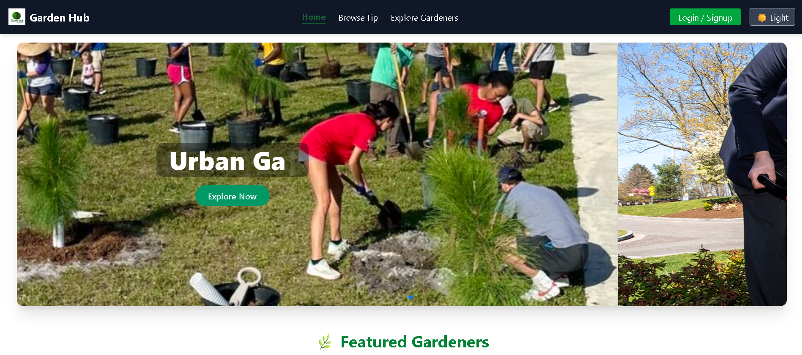

<!DOCTYPE html>
<html lang="en">
<head>
  <meta charset="UTF-8" />
    
</head>
<body>
  <h1>🌿 Garden Hub – Gardening Tips Platform</h1>

  
A community-driven platform for gardening enthusiasts to share, discover, and manage gardening tips tailored by plant type, difficulty level, and category.

  

  <h2>🌐 Live Demo</h2>
  
👉 <a href="https://gardening-hub-client.web.app/" target="_blank" rel="noopener noreferrer">Visit Garden Hub</a>

  

  <h2>📸 Screenshot</h2>
  

  

  <h2>🔑 Features</h2>
  <ul>
    <li> User authentication using Firebase for secure login and personalized experience</li>
    <li> Add gardening tips with title, plant type, difficulty, category, notes, and optional images</li>
    <li> Control visibility of each tip: Public or Hidden</li>
    <li> Categorized by Composting, Plant Care, Vertical Gardening, and more</li>
    <li> Real-time form validation with success/error alerts via SweetAlert2</li>
    <li> Users can update or delete their own submitted tips</li>
    <li> Responsive UI with a user-friendly design for all devices</li>
  </ul>

  

  <h2>🛠️ Tech Stack</h2>
  <ul>
    <li><strong>Frontend:</strong> React, Tailwind CSS, DaisyUI</li>
    <li><strong>Routing:</strong> React Router DOM</li>
    <li><strong>Authentication:</strong> Firebase</li>
    <li><strong>Form Handling:</strong> React Hook Form</li>
    <li><strong>UI Feedback:</strong> SweetAlert2</li>
    <li><strong>State Management:</strong> useState, useEffect</li>
  </ul>

  

  <h2>📦 Major Dependencies</h2>
  <pre><code>
"react"
"react-router-dom"
"firebase"
"react-hook-form"
"sweetalert2"
"tailwindcss"
"daisyui"
  </code></pre>

  

  <h2>⚙️ Run Locally</h2>
  <h3>📁 Clone and Setup</h3>

  <h4>Frontend:</h4>
  <pre><code>git clone https://github.com/tasnimulhasan873/gardening-hub-client.git
cd gardening-hub-client
npm install
npm run dev

  

  <h2>🔗 Relevant Links</h2>
  <ul>
    <li>🔴 <strong>Live Website:</strong> <a href="https://gardening-hub-client.web.app/" target="_blank" rel="noopener noreferrer">https://gardening-hub-client.web.app/</a></li>
    <li>💻 <strong>GitHub Repo:</strong> <a href="https://github.com/tasnimulhasan873/gardening-hub-client" target="_blank" rel="noopener noreferrer">https://github.com/your-username/gardening-hub-client</a></li>
    <li>📄 <strong>Backend Repo (Optional):</strong> Add if you have one</li>
  </ul>

  

  

  <h2>📜 License</h2>
  
This project is licensed under the MIT License.

</body>
</html>
